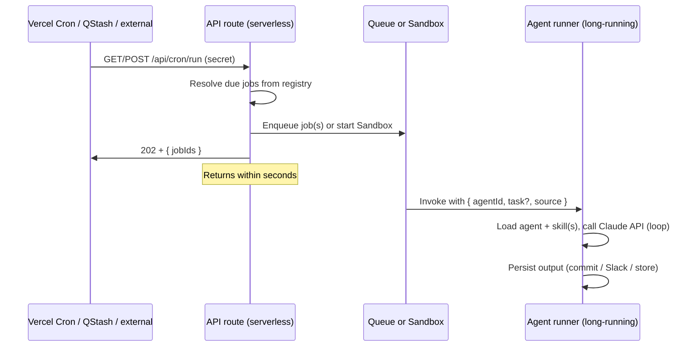
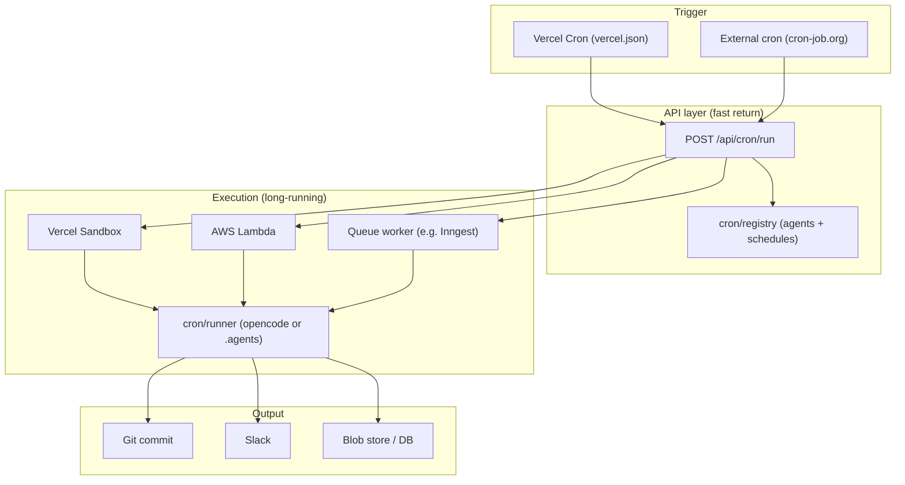
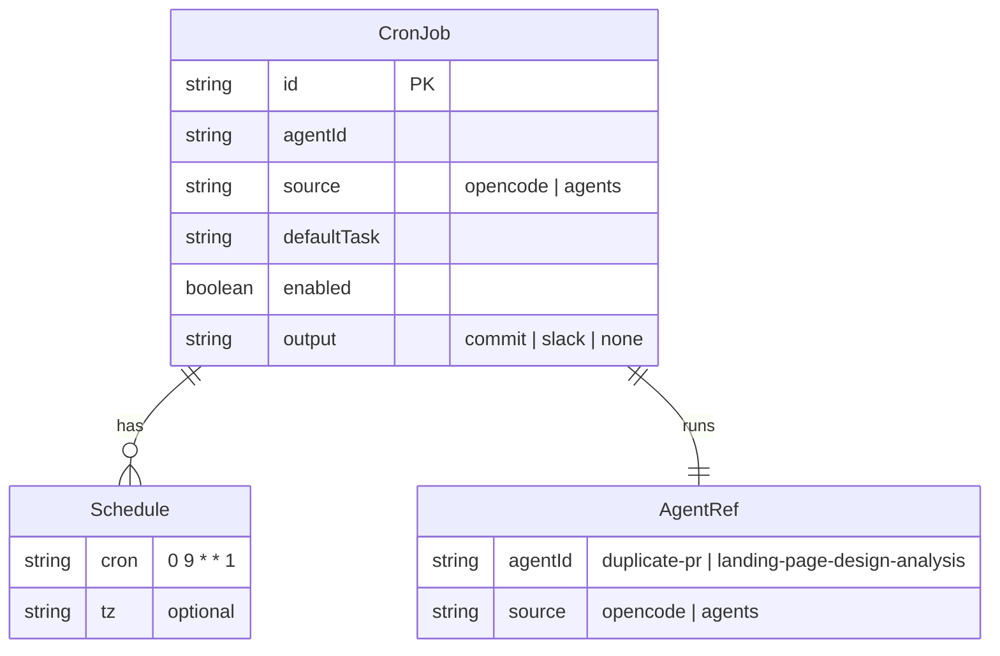

# Run any Claude agents as cron

## Goal

Design a way to run **any** of this repo’s Claude agents on a schedule (cron), using the agreed architecture: **Cron → HTTP endpoint → long-running job** (Vercel Sandbox, Lambda, or queue-backed worker). The endpoint must return quickly; the actual agent run happens in a separate execution environment.

## Context

- **Two agent sources in this repo:**
  1. **OpenCode agents** (e.g. `duplicate-pr`): defined in `opencode/.opencode/agent/*.md`, run via `@opencode-ai/sdk` with `session.prompt({ agent: "<name>", parts })`. Already runnable headlessly (see `opencode/script/duplicate-pr.ts`).
  2. **.agents/ agents** (e.g. `product-manager`, `landing-page-design-analysis`): defined in `.agents/agents/*.md` and `.agents/skills/*/SKILL.md`. Today they are invoked only in Cursor/Claude Code chat. To run on cron they need a **runner** that uses the Anthropic Messages API with agent+skill content as system prompt and implements the tools the skills expect (read_file, write_file, bash, MCP for Slack/Linear/Notion, etc.).

- **Constraint:** Vercel serverless has short time limits (10s–60s). So the HTTP handler triggered by cron must only **enqueue** or **start** the job and return; the long run happens in Vercel Sandbox, AWS Lambda, or a queue consumer.

## Architecture

### Data flow (sequence)



### Component hierarchy



### Entity / config relationship



## Design decisions

### 1. Registry of cron-runnable agents

- **Location:** `cron/registry.json` (or `cron/registry.ts` that exports a typed list).
- **Fields per entry:**
  - `id`: unique job id (e.g. `landing-design-weekly`).
  - `agentId`: agent name (e.g. `landing-page-design-analysis`, `duplicate-pr`).
  - `source`: `"opencode"` | `"agents"` (so the runner knows whether to use OpenCode SDK or the .agents Claude API runner).
  - `schedule`: cron expression (e.g. `0 9 * * 1` = Mondays 9:00).
  - `defaultTask`: optional default user prompt/task for this run (e.g. “Run design analysis for all comparables”).
  - `enabled`: boolean.
  - `output`: where to send results — e.g. `"commit"` (commit to repo), `"slack"` (post to channel), `"none"` (log only).

### 2. API route (trigger only)

- **Path:** `POST /api/cron/run` (or `GET` with same semantics if cron only supports GET).
- **Auth:** Require a shared secret (e.g. `CRON_SECRET` header or query) so only the scheduler can call it.
- **Behavior:**
  - Read registry; compute which jobs are “due” for the current time (or accept body `{ agentId?: string }` to run one specific job).
  - For each due job: enqueue a message (QStash, Inngest, SQS) or call Vercel Sandbox API to start the runner with payload `{ agentId, source, task?, output }`. Do **not** await the full run.
  - Return **202** with a small JSON body (e.g. `{ accepted: true, jobs: [ { id, agentId } ] }`).

### 3. Runner (long-running)

- **Contract:** Runner is invoked with one payload: `{ agentId, source, task?, output? }`.
- **OpenCode path (`source: "opencode"`):**
  - Use `createOpencode()` and `session.prompt({ agent: agentId, parts: [ { type: "text", text: task ?? defaultTask } ] })` (same pattern as `opencode/script/duplicate-pr.ts`). Run inside Sandbox/Lambda/worker with repo (or a clone) and env (e.g. `ANTHROPIC_API_KEY`).
- **.agents path (`source: "agents"`):**
  - Load `.agents/agents/<agentId>.md` and any skill files it references (e.g. from content: “read .agents/skills/landing-page-design-analysis/SKILL.md”).
  - Build a system prompt from agent body + inlined skill content.
  - Call Anthropic Messages API in a loop: send user message (task), handle tool_calls (read_file, write_file, run_bash, list_dir; optionally MCP for Slack/Linear/Notion if available in the runtime). Continue until the model returns a final summary or “DONE”.
  - Persist output per `output` (e.g. commit changed files, post summary to Slack).

### 4. Where the runner runs

| Option | Pros | Cons |
|--------|------|------|
| **Vercel Sandbox** | Same vendor as cron; SDK to start sandbox from route | Sandbox limits (time, resources); need to verify agent-browser/Playwright in sandbox |
| **AWS Lambda** | Long timeout (e.g. 15 min); pay per run | Need to deploy and wire cron (EventBridge or external cron hitting a gateway) |
| **Queue + worker** (QStash, Inngest, etc.) | Decoupled; retries; can use existing Node/Bun worker | Extra infra; worker must have repo + env |

Recommendation: start with **queue + worker** (e.g. Inngest or QStash) so the API route only enqueues; then implement the runner as a script that the worker runs. Add Vercel Sandbox later if you want to avoid a separate worker process.

## File layout (skeleton)

```
cron/
  registry.json          # or registry.ts
  runner.ts              # entry for worker: parse payload, dispatch to opencode or .agents runner
  runners/
    opencode.ts          # run via @opencode-ai/sdk
    agents-claude.ts     # run via Anthropic API + agent/skill .md
api/
  cron/
    run/
      route.ts           # POST /api/cron/run: validate secret, enqueue due jobs, return 202
```

If the app is not yet on Vercel, the same route can be implemented as a serverless function elsewhere (e.g. Netlify, or a small Express on a VM) as long as it returns quickly and delegates execution.

## Security

- **Cron secret:** All requests to `/api/cron/run` must include a shared secret (header or query). Reject 401 otherwise.
- **Allowlist:** Only agentIds present in the registry with `enabled: true` may be run. Reject requests that try to run arbitrary agent names not in the registry.
- **Secrets in runner:** Runner runs in an environment that has `ANTHROPIC_API_KEY`, repo access (e.g. token for push), and optionally Slack/Linear tokens. These must not be in the registry or the API response.

## Out of scope (for later)

- Retry and dead-letter for failed runs.
- Web UI to enable/disable or edit schedules.
- Streaming progress (e.g. SSE) from runner to a dashboard.

## Summary

- **Registry** lists which agents (OpenCode or .agents) are cron-runnable, with schedule and default task.
- **API route** is the only thing cron hits; it enqueues jobs (or starts Sandbox) and returns 202.
- **Runner** is the long-running process that loads the right agent, runs it (OpenCode SDK or Claude API + tools), and persists output. This keeps the design flexible so you can run any Claude agent on a schedule without blocking the cron trigger.
